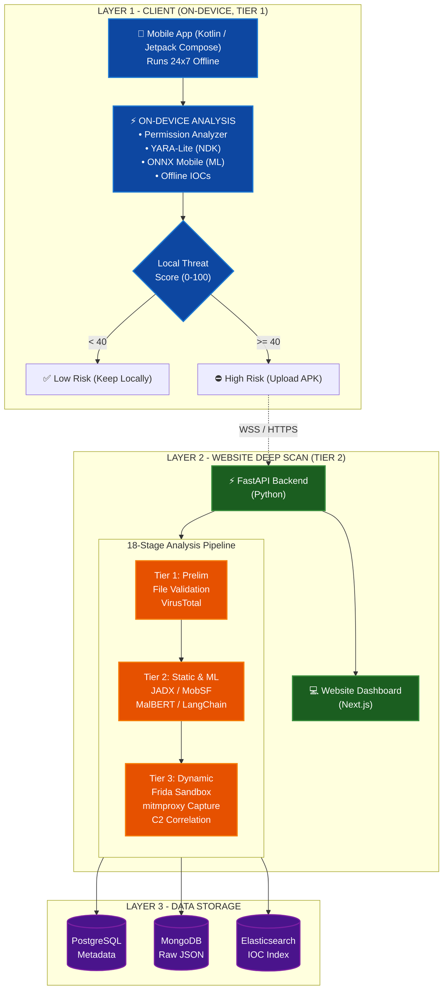

# 🛡️ DroidRaksha (Tier 1 Mobile Agent)

  

**DroidRaksha Mobile** is the "Tier 1" local client of the broader DroidRaksha cyber-defense ecosystem. It operates as an **always-on, offline Android security agent** that performs instant local risk scoring for all installed applications.

## 🏗️ The Two-Tier Architecture

DroidRaksha is explicitly designed as a distributed, two-tier architecture to balance immediate on-device protection with heavy, forensic-grade analysis:

1. **Tier 1 (This Repository - Android App):** A lightweight, always-on client running 24x7 locally. It uses static analysis, local ML models (ONNX), and YARA-Lite to compute an instant local threat score (0-100) for every app on the device—completely offline.
1. **Tier 1 (This Repository - Android App):** A lightweight, always-on client running 24x7 locally. It uses static analysis, local ML models (ONNX), and YARA-Lite to compute an instant local threat score (0-100) for every app on the device—completely offline.
2. **Tier 2 (Website Backend - DroidRaksha Web):** A massive 18-stage deep-scan pipeline for high-risk applications. If Tier 1 flags an app as HIGH/CRITICAL risk, the APK is uploaded to the Tier 2 platform which executes full static analysis (Androguard, MobSF, MalBERT), dynamic network analysis (Frida, mitmproxy sandbox), and generates a court-grade AI narrative using LangChain + Groq/Gemini.

---

## ⚡ Current Capabilities (Tier 1)

The mobile agent currently runs a powerful, multi-engine local analysis pipeline:

- **App Inventory & Metadata Analysis:** Extracts install sources, certificates (detecting self-signed/debug builds), and SDK versions.
- **Permission Combo Analyzer:** Flags dangerous combinations of requested permissions (e.g., SMS + Internet).
- **Offline India-IOC Matcher:** Checks statically extracted domains and strings against known Indian banking/loan scam IOCs.
- **YARA-Lite (NDK):** Runs fast, localized YARA rules directly on the device.
- **ONNX Runtime Mobile:** Executes locally deployed Machine Learning models (XGBoost + Isolation Forest) for anomaly detection and zero-day threat flagging.
- **NetworkStatsManager:** Tracks volume trends for installed applications.

---

## 🚀 Research & Future Implementation Plan

As part of the continuous evolution of DroidRaksha, four major network-analysis capabilities were researched for implementation on the Android client. Based on our source-truth assessment against the Tier 2 website, these are the concrete engineering gaps and our roadmap to bridge them:

### 1. VPN-Based Traffic Capture (No-Root)
Currently, the website uses `mitmproxy` inside a rooted sandbox for traffic capture. To achieve similar visibility on an unrooted user device without breaking TLS pinning, we will implement Android's `VpnService` API (similar to PCAPdroid/NetGuard).
- **Phase 1 (Level A - Metadata Capture):** Ship a metadata-only capture layer (Destination IP, DNS queries, TLS SNI hostnames, and per-app UID attribution). This requires zero decryption, doesn't break apps, and instantly unlocks C2 correlation and DGA detection.
- **Phase 2 (Level B - Deep Capture):** An optional, clearly labeled "Deep Capture" mode featuring full HTTP/S decryption via a local MITM proxy and user-installed CA (best effort for non-pinned apps).

### 2. Live On-Device C2 Detection
The existing `C2BeaconDetector` is solid for static signals (bundled threat intel, YARA hits, coefficient of variation on volume). We will extend this by feeding it **live destination IPs and hostnames** intercepted from the new VPN capture layer, enabling true millisecond-precision beacon timing analysis.

### 3. DGA Domain Detection
A direct, mechanical Kotlin port of the website's zero-dependency `dga_detector.py` engine. It uses Shannon entropy, vowel ratios, and lexical heuristics to score domains. Live SNI/DNS hostnames captured by the VPN will be fed into this engine, and high-scoring hits will escalate the C2 verdict.

### 4. Fast IP Geolocation
Instead of querying rate-limited APIs per lookup (which breaks offline support), the website backend will host a lightweight endpoint wrapping a local MaxMind GeoLite2 database. The Android app will query this to enrich captured IP addresses with City/ASN data, enabling a rich visual map of malicious C2 infrastructure.

### 5. Static ↔ Dynamic IP Correlation
The website's `ip_correlator.py` engine will be ported to Kotlin. It compares static hardcoded IPs (from the string extractor) against dynamically captured IPs (from the VPN layer) and categorizes them into a risk ladder:
- **CRITICAL:** Hardcoded in APK AND seen live (Confirmed C2).
- **HIGH:** Called at runtime but not hardcoded (e.g., fetched/decrypted).
- **MEDIUM:** Hardcoded, dormant (Static only).

---

## 🗺️ Dependency Roadmap & Delivery Order

To efficiently ship the future plan, development will proceed in this order:

1. **DGA Detector:** Pure math Kotlin port (Low risk, isolated).
2. **GeoLite2 Endpoint:** Backend deployment + Android client wiring (Low risk).
3. **VpnService (Level A):** The core engineering lift for live network metadata.
4. **C2BeaconDetector Extension:** Wire the live IP/host feed and precise timing from the VPN.
5. **IpCorrelator:** Kotlin port enriched with geolocation data.
